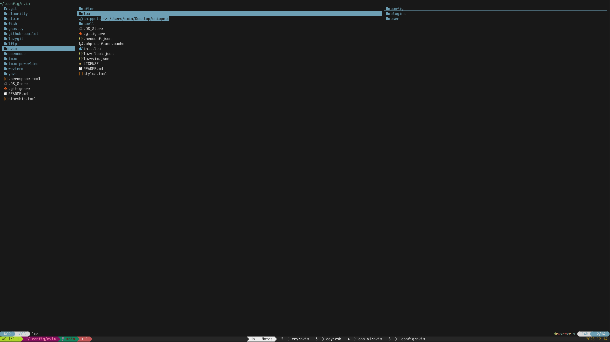

# Terminal + Neovim + Tmux Workflow

This repo contains my daily driver setup on macOS: Alacritty + tmux + Neovim (LazyVim). It’s tuned for fast window/pane navigation, clipboard integration, and a rich Neovim keymap for search, snippets, notes, and utilities.

[Read My Blog](https://sminrana.com)

[FileDiff Neovim plugin](https://github.com/sminrana/nvim-filediff)

**Quick Start**

- Install Alacritty, tmux, Neovim (via Homebrew).
- Launch Alacritty; it auto-starts zsh and attaches/creates a tmux session.
- Use Command-based shortcuts in Alacritty to drive tmux; inside tmux, use `C-a` as prefix.
- Open Neovim and use `<leader>j` prefixed keymaps for personal commands.

**Alacritty**

- Config: `alacritty/alacritty.toml:60`
- Highlights
  - `Cmd-s` sends `Ctrl-s` to terminal for Neovim save: `alacritty/alacritty.toml:63`
  - `Cmd-Shift-f` toggles fullscreen: `alacritty/alacritty.toml:82`
  - `Cmd-a` sends tmux prefix `C-a`: `alacritty/alacritty.toml:64`
  - `Cmd-t` new tmux window, `Cmd-[` prev window, `Cmd-]` next window: `alacritty/alacritty.toml:72`
  - `Cmd-Shift-x` instant kill active pane/window via tmux `X`: `alacritty/alacritty.toml:80`
  - `Cmd-1…9` switch tmux windows directly: `alacritty/alacritty.toml:84`
- Shell integration: starts zsh and runs `t` to attach tmux: `alacritty/alacritty.toml:96`

**tmux**

- Config: `tmux/.tmux.conf:1`
- Prefix: `C-a` (unbind default `C-b`): `tmux/.tmux.conf:1`
- Splits: `-` vertical, `|` horizontal with cwd preserved: `tmux/.tmux.conf:13`, `tmux/.tmux.conf:14`
- Resize: `prefix + h/j/k/l` resizes by 5: `tmux/.tmux.conf:17`
- Kill pane
  - `x` asks confirm: `tmux/.tmux.conf:7`
  - `X` instant kill (pane if multiple; otherwise window): `tmux/.tmux.conf:10`
- Clipboard: copy-mode `y` pipes to macOS clipboard: `tmux/.tmux.conf:28`
- Vim navigation passthrough (C-h/j/k/l between tmux panes and Neovim): `tmux/.tmux.conf:96`
- Plugins via TPM: yank, copycat, resurrect, continuum (auto-restore), prefix-highlight, tmux-powerline, open: `tmux/.tmux.conf:71`
- Session switch menu script: `tmux/scripts/session-menu.sh:1`

**Neovim (LazyVim)**

- Entry: `nvim/init.lua:1` autoloads LazyVim and all `lua/user/*` modules.
- Options: `nvim/lua/config/options.lua:4`
  - FZF as picker, animations off, autoformat off, spell on.
- Personal keymap prefix: `<leader>j`: `nvim/lua/config/keymaps.lua:2`

**Neovim Keymap Highlights**

- Navigation/UI
  - File tree: `<leader>e` neotree reveal float: `nvim/lua/config/keymaps.lua:57`
  - FZF launcher: `<leader>F`: `nvim/lua/config/keymaps.lua:59`
  - Buffers grep: `<leader>jba`: `nvim/lua/config/keymaps.lua:89`
  - Open files in `~` via FZF: `<leader>jfo`: `nvim/lua/config/keymaps.lua:426`
- Daily notes
  - Open goals: `<leader>jD`: `nvim/lua/config/keymaps.lua:67`
  - Open notes: `<leader>jN`: `nvim/lua/config/keymaps.lua:68`
- Clipboard helpers
  - Copy path: `<leader>jf1` abs, `<leader>jf2` rel, `<leader>jf3` name: `nvim/lua/config/keymaps.lua:72`
- Tasks/Markdown
  - Toggle checkbox: `<leader>jt0`: `nvim/lua/config/keymaps.lua:232`
  - Status stamps: done/bug/in-progress/etc: `<leader>jtx`, `tb`, `tp`…: `nvim/lua/config/keymaps.lua:164`
  - Bold/italic/strikethrough line: `<leader>jm5`, `jm6`, `jm4`: `nvim/lua/config/keymaps.lua:257`
  - Open task list: `<leader>jtd` and add: `<leader>jtn`: `nvim/lua/config/keymaps.lua:242`
- Grep by project roots
  - `~/app`: `<leader>jfa`, `~/web`: `<leader>jfw`, notes/snippets: `<leader>jfx`, `jfs`: `nvim/lua/config/keymaps.lua:73`
- Snippets (nvim-scissors)
  - Add: `<leader>jsa`, Edit: `<leader>jse`: `nvim/lua/config/keymaps.lua:75`
- S3 utilities
  - Upload current buffer: `<leader>jf7`: `nvim/lua/config/keymaps.lua:93`
  - Pick from screenshots dir: `<leader>jf6`: `nvim/lua/config/keymaps.lua:94`
  - Upload any file: `<leader>jf5`: `nvim/lua/config/keymaps.lua:95`
  - MOV→MP4 with external audio (YouTube-ready): `<leader>jf8`: `nvim/lua/config/keymaps.lua:298`
- Editing utilities
  - Remove inner whitespace, keep indent: `<leader>jrw`: `nvim/lua/config/keymaps.lua:406`
  - Search/replace prompts: `<leader>jR`, `jrc`, `jrd`, `jra`: `nvim/lua/config/keymaps.lua:458`
  - Strip +/- from selected lines: visual `<leader>jrm`: `nvim/lua/config/keymaps.lua:499`
  - Tabs/spaces toggle: `<leader>jb<tab>`, force spaces: `jbs`, force tabs: `jbt`: `nvim/lua/config/keymaps.lua:687`
  - Reveal file in Finder: `<leader>jbf`: `nvim/lua/config/keymaps.lua:691`
  - Print buffer via TextEdit: `<leader>jp`: `nvim/lua/config/keymaps.lua:716`
- Git helpers
  - Open modified files in new tabs: `<leader>jgo`: `nvim/lua/config/keymaps.lua:654`
- App launcher
  - Spotlight-like app/folder open: `<Leader>A`: `nvim/lua/config/keymaps.lua:780`

**Workflow**

- Windowing: Use Alacritty `Cmd-1…9`, `Cmd-[`, `Cmd-]` to move between tmux windows. `Cmd-t` to create new tmux window.
- Panes: Split with `prefix + -` (vertical) or `prefix + |` (horizontal). Resize with `prefix + h/j/k/l`.
- Kill: `Cmd-Shift-x` for instant kill via tmux `X`, or `prefix + x` for confirm.
- Copy: In tmux copy-mode press `y` to yank to macOS clipboard.
- Neovim: Use `<leader>j` groups for tasks, grep, snippets, S3 uploads, and utilities.

**Scripts**

- Session menu: `tmux/scripts/session-menu.sh:1` shows a popup menu to switch sessions.

**Setup Notes**

- Fonts: JetBrainsMono Nerd Font: `alacritty/alacritty.toml:29`
- Terminal type: `TERM=alacritty`: `alacritty/alacritty.toml:1`
- Fullscreen on launch: `startup_mode = "SimpleFullscreen"`: `alacritty/alacritty.toml:18`
- Mouse + vi copy-mode in tmux enabled: `tmux/.tmux.conf:40`

**Optional Terminals**

- WezTerm and Ghostty also work well. If you prefer them, replicate the tmux passthrough and window bindings accordingly.

**Troubleshooting**

- Clipboard not working: ensure `pbcopy` exists; tmux config also tries `xclip`/`wl-copy` for Linux: `tmux/.tmux.conf:42`
- S3 uploads: requires `aws` CLI and proper credentials; ffmpeg for video conversion.

Enjoy the workflow, and tweak bindings to taste.

